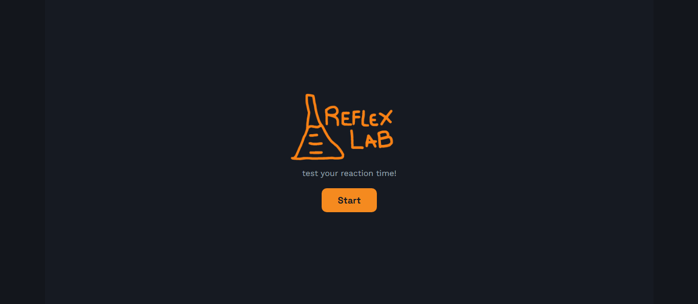
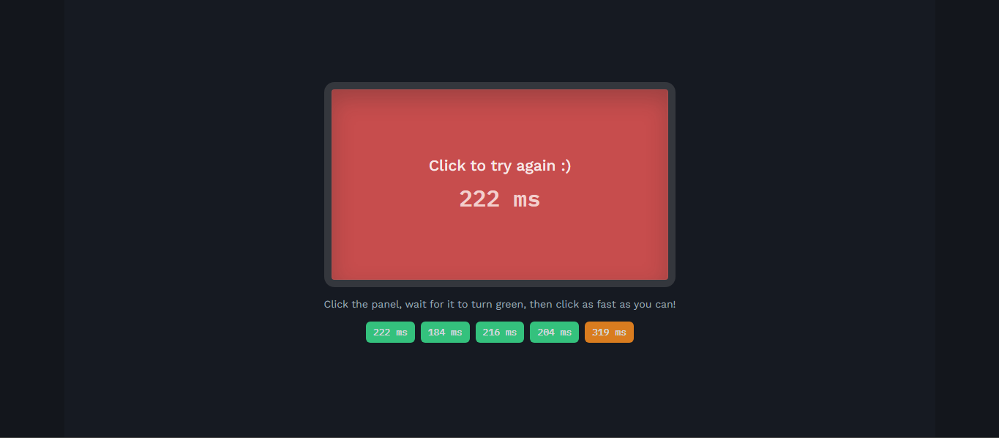
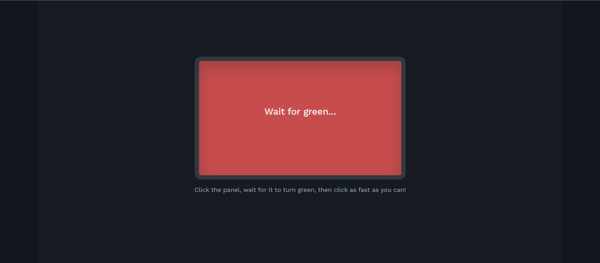
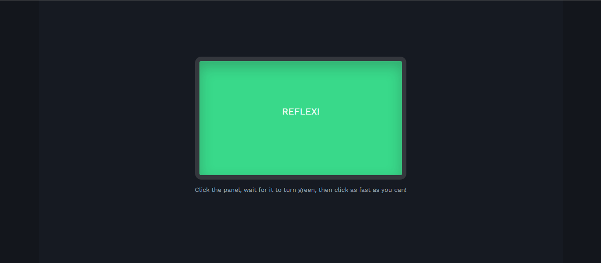

# Reflex-Lab

A minimal reaction time tester inspire by the "lights out" reaction tests Formula 1 drivers do at the start of a race :)
Wait for the panel to turn green, then click (or press SPACE) as fast as you can.

> This project used AI for improvement suggestions, debugging help, and quick fixes along the way.

## Overview

ReflexLab is my second HTML project. The first one leaned a lot on visual design I drew by hand, with fairly simple functionality behind it. 
This time I wanted to build something from scratch myself and actually focus on the logic, without worrying too much about how it looks (CSS still isn't reaaaally my thing..)

I like simple games that are easy to pick up, and I'm a big F1 fan, so this felt like a fun, small project to learn from.

## How it works

The game runs on a simple state machine with three states: `idle`, `armed`, and `ready`.

1. **Idle** - the panel is waiting for input. Clicking it (or pressing space) arms the round.
2. **Armed** - the panel turns red and a random delay (1-4 seconds) is scheduled with `setTimeout`. This randomness prevents the player from predicting when the panel will turn green. Clicking during this state counts as a false start ("too early").
3. **Ready** - once the delay ends, the panel turns green and the exact timestamp is recorded using `performance.now()`. Clicking now calculates the reaction time as the difference between the click timestamp and that recorded moment, displays it, and logs it to the history list.

A single function decides what a click or keypress should do based on the current state - arm the round, register a false start, or register a valid reaction time. (`startOrReact()`)

Each completed attempt is added to a history list (capped at 5 entries) and color coded based on how fast it was.

## How to run It

1. Clone or download this repository
2. Open `index.html` in a browser

No built steps, dependencies or installation required

## Other

**Fonts:** Space Grotesk, IBM Plex Mono, Work Sans - all via Google Fonts. (https://fonts.google.com/specimen/Space+Grotesk) (https://fonts.google.com/specimen/IBM+Plex+Mono) (https://fonts.google.com/specimen/Work+Sans)

Built with HTML, CSS and JavaScript
References: W3Schools, StackOverflow

